[LinkedIn](https://www.linkedin.com/in/humaira-khaliq-92511039a) &nbsp;·&nbsp;
[email](humirakhaliq2@gmail.com)

> Web developer focused on building modern, interactive web experiences.

Currently working with JavaScript / TypeScript, React / Next.js, Tailwind CSS, 
Three.js, and GSAP.

<samp>javascript &nbsp; typescript &nbsp; html &nbsp; css &nbsp; react &nbsp; next.js &nbsp; tailwind &nbsp; mui &nbsp; redux &nbsp; scss &nbsp; bootstrap &nbsp; php &nbsp; mysql &nbsp; jest &nbsp; git and github &nbsp; figma</samp>

**3D Web** &nbsp;·&nbsp; <samp>three.js, webgl, glsl</samp> 
**Creative Development** &nbsp;·&nbsp; <samp>motion, interaction, animation</samp> 
**3D** &nbsp;·&nbsp; <samp>blender, 3D workflows</samp>

**2024** — Started learning web development; built a foundation in HTML, CSS, 
and JavaScript.

**2025** — Expanded into PHP and MySQL, exploring backend fundamentals.

**2026** — Learned React and Next.js through Code to Inspire. Now diving into 
Three.js, GSAP, and Blender, exploring creative development and 3D on the web.

Frontend Architecture &nbsp;·&nbsp; Scalable & Maintainable UI &nbsp;·&nbsp; Full-Stack Development 
Creative Development &nbsp;·&nbsp; Three.js & WebGL &nbsp;·&nbsp; Motion & Interaction

